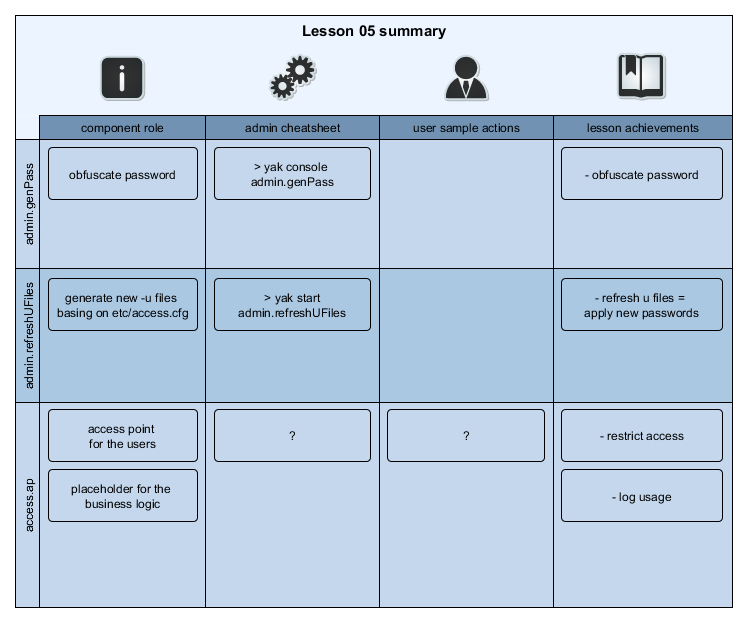

[:arrow_backward:](../Lesson04)
<!------------------------------------------------------------------------------------------------->

<!------- https://github.com/exxeleron/enterprise-components/tree/master/tutorial/Lesson05 -------->

#                     **Lesson 5 - Security in Enterprise Components**

<!------------------------------------------------------------------------------------------------->
## Goal of the lesson

In [Lesson 4](../Lesson04) we added new component - `accessPoint`. This component exposes query
interfaces for users to run. In this lesson we will learn how to extend this component with security
settings.

<!------------------------------------------------------------------------------------------------->
## Prerequisites

It is assumed that [Installation](../Installation.md) page is read, system is deployed and
working. Specifically these sections should be looked at in more detail:
- [System installation](../Installation.md#demosystem-installation)
- [System startup](../Installation.md#demosystem-startup)
- [Switching Lessons](../Installation.md#changing-demosystem-lesson)

<!------------------------------------------------------------------------------------------------->
## Components used

This lesson expands the system from [Lesson 4](../Lesson04) with additional `accessPoint`
configuration:

- new users and groups
- user access restrictions
    


<!------------------------------------------------------------------------------------------------->
## Resources in the system


<!------------------------------------------------------------------------------------------------->
## Enterprise Components security model

Enterprise Components can be setup to allow only specific users in the system
(_authentication_). Those users can granted access only to specific resources
(_authorization_). 

### Authentication

Authentication specifies which users can log to the system. It is possible to differentiate
component instances with different user sets.

Authentication in Enterprise Components utilizes raw `-u`/`-U` command line parameters passed to
`q`.
 
> Note:
>
> You can read more about `-u`/`-U` `q` command line parameters
> [here](https://code.kx.com/wiki/Reference/Cmdline).


### Authorization

Authorization specifies access to resources available for users. It also specifies how detailed
should be the checks of queries issued by users.

It is possible to block query execution basing on forbidden words (`stopWords`) or allowed `q`
 namespaces.

Authorization checks can be set on different levels:
- `NONE` - do not perform any query checks; allow user to freely run code. Recommended for technical
  users.
- `STRICT` - allow only functional-form queries; do not check `stopWords`; check function name against
  allowed namespaces. Recommended for interface functions' calls (e.g. from qJava)
- `FLEX` - perform detailed check on a query (functional or passed as string); check against
  `stopWords` and allowed namespaces but allow nested function calls

<!------------------------------------------------------------------------------------------------->
## Configuration files

### `system.cfg`

Authentication flags (`uOpt`/`uFile`) are set in `system.cfg` file. 

You can enable or disable authentication in `system.cfg` configuration file. Component instances
which have `uOpt` and `uFile` flags set will allow only users defined in `access.cfg` file.


```diff
--- system.cfg     (Lesson 4)
+++ system.cfg     (Lesson 5)

+ 91. #------------------------------------ security -------------------------------#
+ 92.   # use specified user flag on all processes (unless redefined somewhere)
+ 93. uOpt = U
+ 94.   # use specified user file on all processes (unless redefined somewhere)
+ 95.   # Each component instance gets it's own user file.
+ 96. uFile = ${EC_SYS_PATH}/data/shared/security/${EC_COMPONENT_ID}.txt

...

+ 144. [group:admin]
+ 145.   [[admin.genPass]]         # component 'admin.genPass' (EC_COMPONENT_ID) used for
+ 146.                             # interactive password generation
+ 147.     uOpt = NULL             # uOpt and uFile cannot be set on this component. Redefining
+ 148.     uFile = NULL            # those values here.
+ 149.     port = 0                # port field has no default value. In order to run process
+ 150.                             # without port, set it to zero
+ 151.     type = b:authentication/authentication
+ 152.     command = "q genPass.q"
+ 153.
+ 154.   [[admin.refreshUFiles]]   # component 'admin.refreshUFiles' (EC_COMPONENT_ID) refreshing
+ 155.                             # user files
+ 156.     uOpt = NULL
+ 157.     uFile = NULL
+ 158.     port = 0
+ 159.     type = b:authentication/authentication
+ 160.     command = "q refreshUFiles.q"
```

### `access.cfg`

Users, groups, authorization and are defined in `access.cfg` file.

```diff
--- access.cfg     (Lesson 4)
+++ access.cfg     (Lesson 5)

+ 20. #---------------------------- ordinary users ---------------------------------#
+ 21.   # ordinary users are used by end-users of the system. 
+ 22.   # users are defined each in its own section, with pass and usergroups fields
+ 23.   # set (similar to technicalUser above).
+ 24. [user:demo]
+ 25.   pass = 0xaaaba3a1bbbdabbc # Password as generated by admin.genPass script.
+ 26.   usergroups = demoquery    # Groups users is assigned to. (Groups defined below.)

...

+ 37. [userGroup:demoquery]
+ 38.   # List of forbidden words. Including any of these words in a query will cause query
+ 39.   # to be blocked.
+ 40.   stopWords = <type(LIST STRING), default(delete,exit,access,value,save,read0,read1,insert,update,system,upsert,set,.z.pw,.z.pg,.z.ps,.z.pi,.z.ph,.z.pp,.z,parse,eval,.q.parse,.q.eval,.q.system,.z.exit,.z.po,.z.pc,.ap.cfg.serverAux,.ap.cfg.timeout,.auth.stopWords,.auth.status,.auth.user2nm,\\,\)> 
+ 41.   [[ALL]]
+ 42.     checkLevel = STRICT # By default allow only parse-tree queries and only to .hnd
+ 43.                         # namespace
+ 44.     namespaces = .hnd
+ 45.   [[access.ap]]
+ 46.     checkLevel = FLEX   # Allow executing `freestyle` queries but check them against
+ 47.                         # stopWords and available namespaces
+ 48.     namespaces = .demo

```

## Using the system

### Generating user passwords

Passwords stored in Enterprise Components configuration files are XOR-ed against built-in mask. For
simplicity of this lesson, default mask value is used.

> Note:
>
> XOR mask is stored in `.sl.p.m` variable in `qsl/sl.q` file. It is advised to change this mask on
> productive systems.

In order to generate a new password for a user (XOR password), please run `admin.genPass` in
interactive mode (we used `demouser` as a password for a user we added in this lesson):

```bash
DemoSystem> yak console admin.genPass
Starting interactive console...
[ --- output truncated --- ]
Please enter new password: demouser
Please re-enter new password: demouser
New password is: 0xaaaba3a1bbbdabbc
```

New password value is given in hexadecimal representation. It should be placed in `access.cfg`
exactly as returned by `admin.genPass`.

### Applying password to the system (`refreshUFiles`)

In order to apply new password to configured components, _u files_ need to be refreshed. Run:

```bash
DemoSystem> yak console admin.refreshUFiles
Starting interactive console...
[ --- output truncated --- ]
INFO  2014.06.01 03:05:11.775 ru    - Refreshing user access files...
INFO  2014.06.01 03:05:11.786 ru    - Create security file in :/DemoSystem/data/shared/security/access.ap.txt with #users:2
INFO  2014.06.01 03:05:11.786 ru    - Create security file in :/DemoSystem/data/shared/security/core.gen.txt with #users:2
INFO  2014.06.01 03:05:11.787 ru    - Create security file in :/DemoSystem/data/shared/security/core.hdb.txt with #users:2
INFO  2014.06.01 03:05:11.787 ru    - Create security file in :/DemoSystem/data/shared/security/core.rdb.txt with #users:2
INFO  2014.06.01 03:05:11.787 ru    - Create security file in :/DemoSystem/data/shared/security/core.tick.txt with #users:2
INFO  2014.06.01 03:05:11.787 ru    - Refresh completed
```
### Verifying access settings

#### queries on FLEX level

As mentioned before, `FLEX` allows to execute queries that conform to allowed namespaces and do not
contain any words specified in `stopWords`.

```
// query executed on access.ap as 'demo' user
q).example.tradeStats[]
hh| cnt  
--| -----
19| 10500
```

It is also possible to pass nested function calls as parameters to predefined queries. 

```
// query with function call as a parameter
q).example.tradeStats[1+1]
hh| cnt  
--| -----
19| 10550
```
Anonymous functions are also allowed in queries, unless they contain any `stopWords`.

```
// query with anonymous function as parameter (might cause side-effects and be potentially dangerous)
q).example.tradeStats[{sum x}[1 1]]
hh| cnt  
--| -----
19| 10590
// stop word included in query body
q).example.tradeStats[{delete from .hnd.status}`]
'access denied

```

#### queries on STRICT level
> **TODO** execute sample queries on core.rdb but need to setup standalone q process for that.
```
/executed in a standalone q session
q)h:hopen `:localhost:17011:demo:demouser
/ we fake empty parameter list here to get keyed table content
q)h (`.hnd.status;::)
server   | timeout state connstr                   handle ashandle topen     ..
---------| ------------------------------------------------------------------..
         |                                         ()     ()                 ..
/ let's open some connection
q)h (`.hnd.hopen;`access.ap;100i;`eager)
/ we can observe changes in .hnd.status table
q)h (`.hnd.status;::)
server   | timeout state connstr                   handle ashandle topen     ..
---------| ------------------------------------------------------------------..
         |                                         ()     ()                 ..
access.ap| 100     open  ::17050:tu:0xbabbbbbdabbc 11i    -11i     2014.06.01..
/ or only access.ap rows with parameter
q)h (`.hnd.status;`access.ap)
timeout  | 100
state    | `open
connstr  | `::17050:tu:0xbabbbbbdabbc
handle   | 11i
ashandle | -11i
topen    | 2014.06.01D04:45:36.364768000
tclose   | 0Np
tlost    | 0Np
reconn   | 0
msg      | ""
remoteHnd| 0N
```

#### NONE check level description
> **TODO** add some samples

#### Additional user and group

> c) **TODO** Add additional user and group to show that it is possible to have different number of users on
> different processes? Currently all processes have two users configured.

## Summary



<!--------------------------------------------------------------------------------------------------------------------->
[:arrow_backward:](../Lesson04)

<sub>[Super Mono Icons](http://files.softicons.com/download/toolbar-icons/super-mono-sticker-icons-by-double-j-design/readme.txt) 
by [Double-J Design](http://www.doublejdesign.co.uk/) / [CC BY 3.0](http://creativecommons.org/licenses/by/3.0/)</sub>
