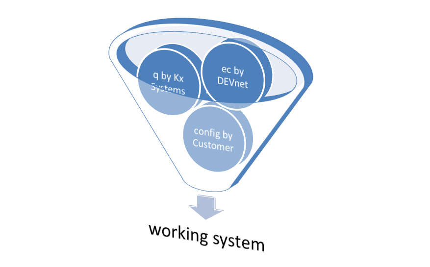
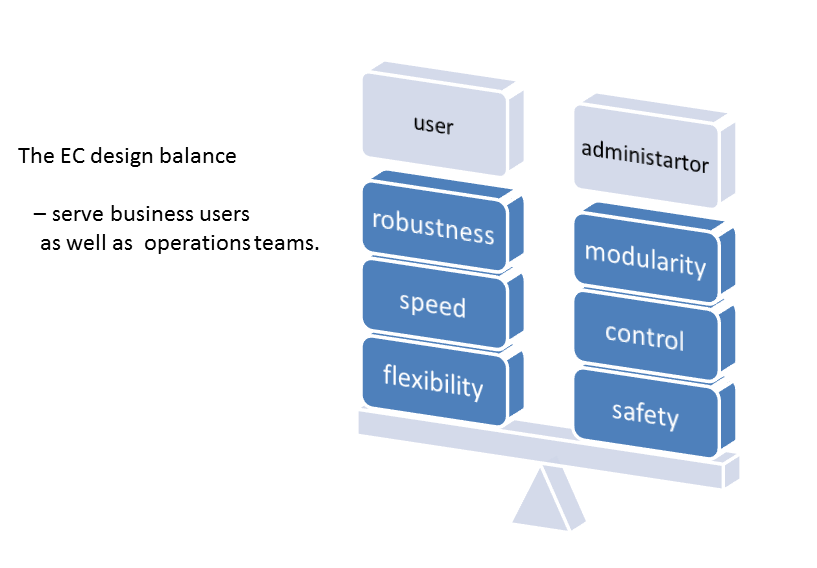
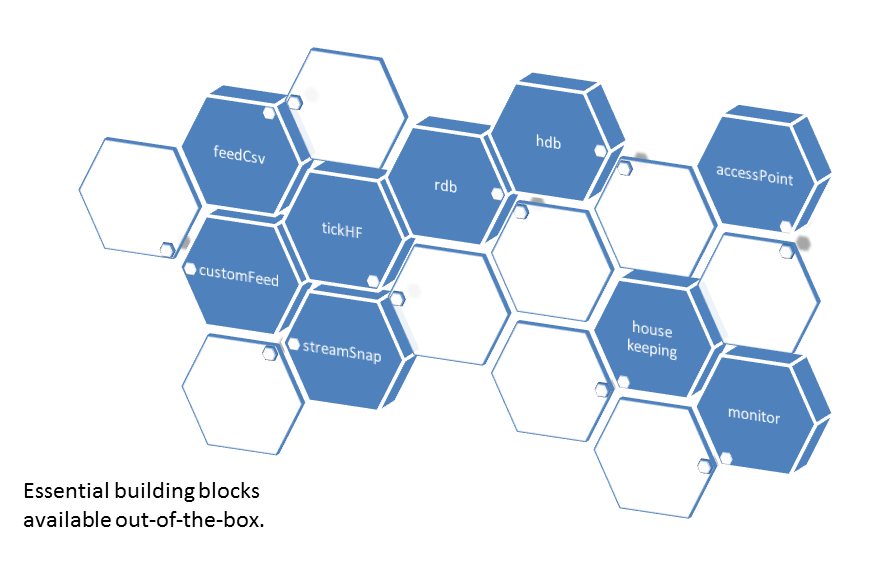
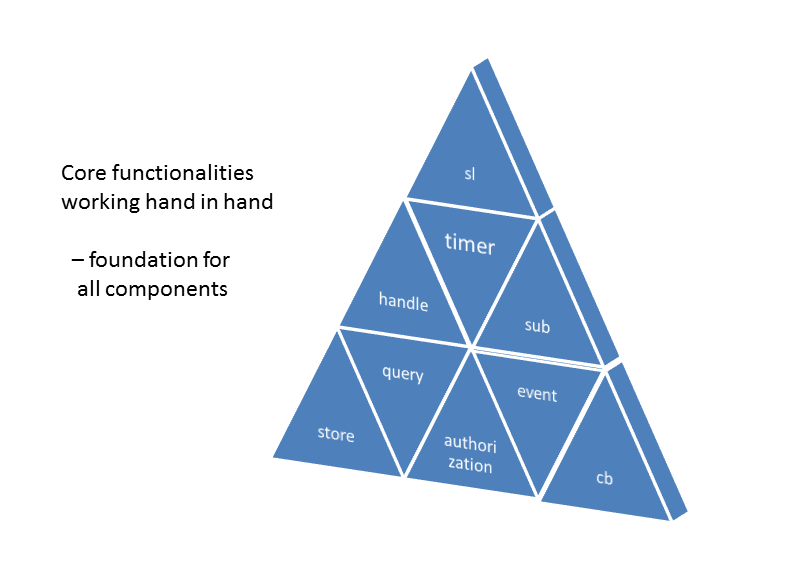
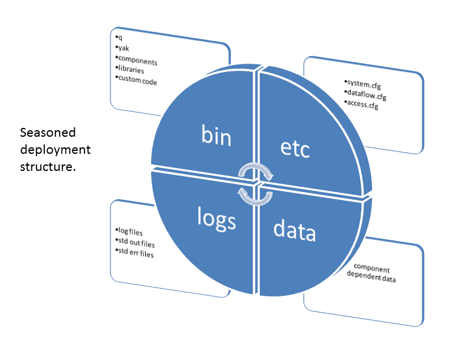
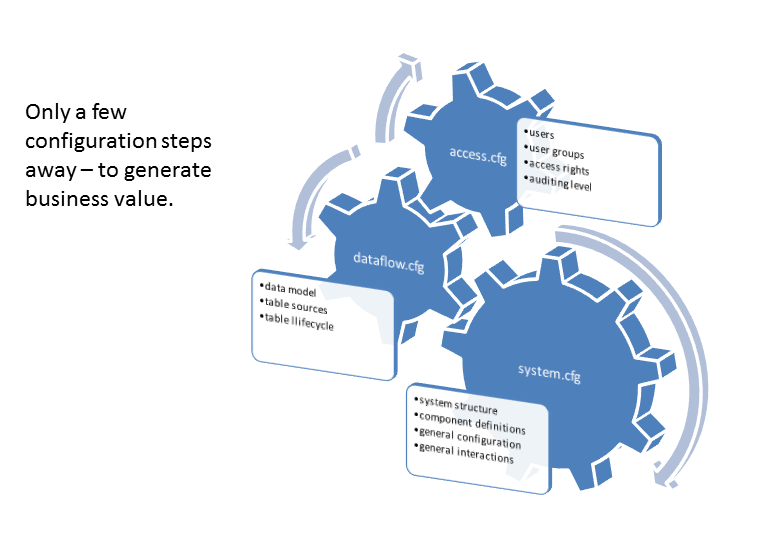

## `enterprise-components` for `kdb+`

`enterprise-components` are a set of open source building blocks on top of `kdb+` allowing you to setup a system for data warehousing and 
analytics in just a few simple steps. It facilitates building of the professional data system covering:
- data import
- storage
- quality assurance
- data analytics
- data extraction
- interfacing with other systems

User can fully customize system architecture through configuration files without `q` knowledge. 

 

### Download

Most recent `DemoSystem` can be downloaded from the [releases page](https://github.com/exxeleron/enterprise-components/releases).

### Documentation
Some basic information can be found below, for more extensive documentation refer to the [documentation folder](doc/README.md).

For list of features, changes and fixes in each release refer to [changelog](CHANGELOG.txt) or 
[releases page](https://github.com/exxeleron/enterprise-components/releases).

### Tutorial
Beginners to `kdb+`/`q` and `enterprise-components` should probably start with the [tutorial](tutorial) that covers the essential basics 
via set of lessons.

## General description

### Objective
`enterprise-components` have been designed with the goal to provide core functionality to `kdb+` installations:
- complying with well-known IT policies for enterprise infrastructures
- keeping the performance and flexibility of `kdb+`
- making `kdb+` development easier as well as faster and infrastructures more robust
- ensuring efficient operations of `kdb+` infrastructures

In order to achieve these goals Exxeleron’s solutions follow best practices for robust and efficient IT service delivery and system 
architecture. `enterprise-components` development is guided by overall TCO (total cost of ownership) considerations where special attention 
is given to: 
- System Vision - new infrastructure should fit naturally into the architectural blueprint, ensuring long-term return on investment 
- Flexibility and Low Coupling - avoiding dependencies and complexity where possible 
- Reuse and Modularity - profiting from investments within their respective core capabilities 
- Flexibility - adaptation to changing business needs should be possible with small investments
- Service Orientation - low TCO and well behaved integration functionality silos 
- Low Maintenance - robustness and automation built-in 

Customers building their `kdb+` architectures with `enterprise-components` benefit from:
- reduced time-to-market cycles due to the wide set of supported features available out-of-the-box
- efficiently managed operational risks due to proven `kdb+` design principles
- simpler architectures due to consistent system design and system operations
- motivated `kdb+` teams focusing on core business requirements rather than basic infrastructure functionality

### Key features
`enterprise-components` provide an optimized set of building blocks that can get quickly assembled into complex `kdb+` deployments. 

Building blocks are based on common foundation - set of libraries built on top of `q`. The libraries are unifying and facilitating usage of 
various `q` resources. New building blocks can be easily created by using these libraries which enable development process and allow natural 
integration with the rest of the system.

`enterprise-components` enable management of the data flow at all levels, starting from high-frequency data capture and stream distribution 
through on-stream, in-memory, and on-disk data analysis to interface components for applications and programming languages.

`enterprise-components` functionality is driven by real-life needs. It combines DEVnet experience with modular  `kdb+` installations that 
harness `kdb+'s` full power and flexibility. 

With scalability, flexibility, robustness, optimization and consistent configuration as design goals it plays well in enterprise deployment.

