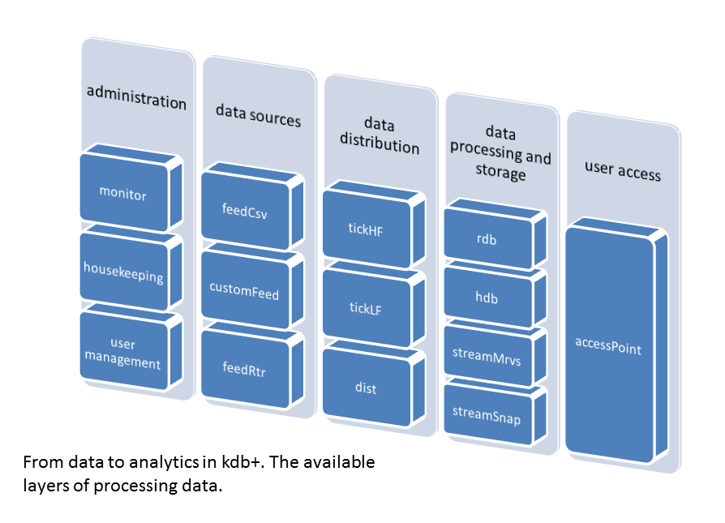

# **enterprise-components**

Kdb+ enterprise architectures for the management and analytics of large datasets are split into
various components (building blocks). Each component strictly follows the defined design principles:
- public functions as fully documented APIs
- consistent logging
- interfaces for monitoring and process control

### Data feeding

#### [feedCsv](feedCsv) - Generic CSV files reader and publisher
  - provides fully customizable and configurable CSV file parser publishing data to [tickLF](tickLF)
    and/or [tickHF](tickHF)
  - enables automatic detection of CSV input files in specified locations on local drive
  - shields the system from corrupted data sets
  - archives processed files (if required)

### Data distribution

#### [tickHF](tickHF) - Publishing and distribution of High Frequency data
  - tuned for handling large volumes of data
  - ensures minimal latency publishing
  - maintains subscription lists
  - provides data recovery facility (all records stored in binary journal) 
  - performs journal rollover at end-of-day

#### [tickLF](tickLF) - Distribution of Low Frequency data
  - designed for reference data handling 
  - handles inserts, upserts, updates and deletes
  - allows data validation (e.g. model consistency check)
  - allows data enrichment via user defined plugins (e.g. adding time column, adjustments of data
    content, etc.)
  - provides data recovery facility (all records stored in binary journal)
  - performs journal rollover at end of day
  - maintains subscription lists
  - provides ability for using custom plugins

Custom plugins are helpful tools when there is a need for data or model manipulation. For example,
if received data does not contain a time column which is required in the data model, the user can
use a custom plugin to dynamically add this missing column to the output table.

### Data processing and storage

#### [rdb](rdb) - In-memory database 
  - allows configuration of subscription and end-of-day process
  - performs auto re-subscription and auto reconnection mechanism to [tickHF](tickHF) and [tickLF](tickLF)
  
#### [hdb](hdb) - Historical database

#### [eodMng](eodMng) - End-of-day processing
  - provides mechanism for hdb data synchronization between different machines
  - allows hdb housekeeping via predefined plugins (deletion, compression, conflation)
  - exposes API for defining custom plugins
  
#### [stream](stream) - Stream-based data processing
  - allows on the fly data processing published via [tickHF](tickHF)
  - provides access to derived data via [accessPoint](accessPoint)
  - allows storing derived data in [rdb](rdb)/[hdb](hdb)
  - facilitates quick recovery after restart
  - performs journal rollover at end-of-day

### Data access

#### [accessPoint](accessPoint) - End users entry point
 - performs user authentication and authorization
 - facilitates connections to other q processes (e.g.  [rdb](rdb),  [hdb](hdb) )
 - enforces access control by defining functions that are permitted to specific users

### System maintenance

#### [yak](https://github.com/exxeleron/yak/) - Process Management Tool
  - manages (starts/stops/restarts) different type of processes
  - manages group of processes (aligned with resolved dependency order)
  - provides convenient access to process status and detailed process information
  - offers robust configuration mechanism
  - delivers bootstrapping for managed processes
  - allows interrupting managed processes (UNIX only)
  - supports custom pager/viewer for log files, standard output, and standard error
  - provides top-like functionality
  
#### [hk](hk) - Housekeeping
  - performs system artifacts cleaning (compress and delete actions)
  - integrated into Enterprise Components deployment structure (no cron dependencies for execution
  scheduling)

### Monitor server

#### [monitor](monitor) Server monitoring tool
  - allows capturing various information about system state, inter-process communication state,
    system events (like initialization of each component, subscription, journal replay), OS
    resources usage
  - publishes data in [tickHF](tickHF) protocol - can be stored in [rdb](rdb) and [hdb](hdb) for later analysis or
    processed in any [tickHF](tickHF) protocol-compatible tool e.g. stream process

### Testing

#### [qtest](qtest) - Test framework
  - execution of tests organized into test suits
  - test cases defined as q functions
  - set of convenient assertions
  - integration with `enterprise-components` - process management helper functions, remote assertions
  - facilities for test debugging
  - result export to xml file (compatible with `JUnit` format)

#### [mock](mock) - Set of mock used for various tests
  - [mock/gen](mock/gen.q) - dummy data-stream generator
  - [mock/empty](mock/empty.q) - empty process with configuration loaded
  - [mock/hdbMock](mock/hdbMock.q) - [hdb](hdb) mock
  - [mock/tickHFMock](mock/tickHFMock.q) - [tickHF](tickHF) mock
  - [mock/rdbPluginMock](mock/rdbPluginMock.q) - [rdb](rdb) plugin mock
