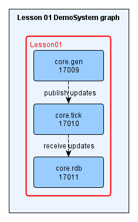
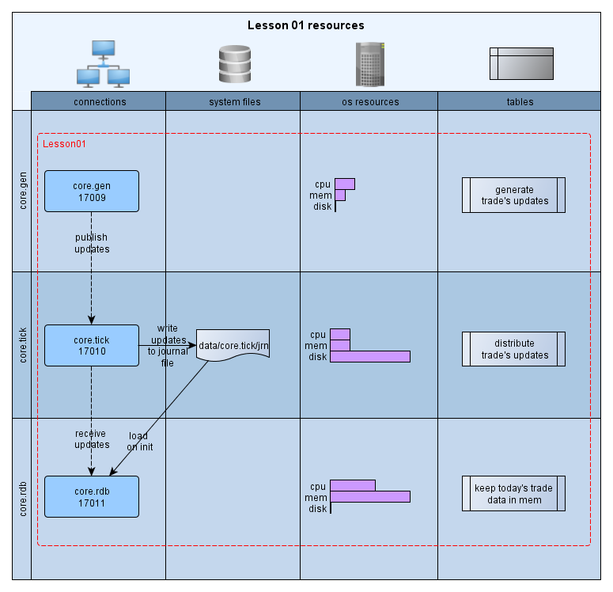
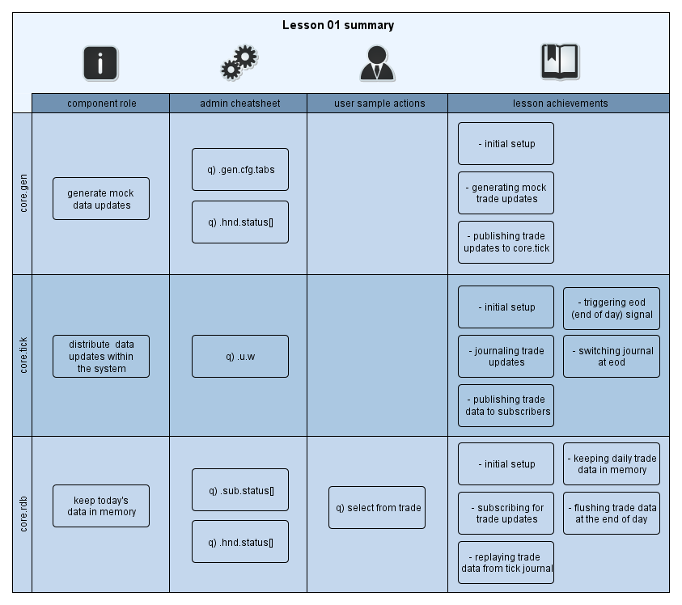

[:arrow_backward:](../Installation.md) | [:arrow_forward:](../Lesson02)

<!----------------- https://github.com/exxeleron/enterprise-components/tree/master/tutorial/Lesson01 ------------------>

#                                         **Lesson 1 - Basic system**

<!--------------------------------------------------------------------------------------------------------------------->
## Goal of the lesson

The main goal of this lesson is to get familiar with basic concepts (configuration, running the
system, etc.) and to create a working system which:

- generates random data,
- distributes data and stores it in in-memory database.

In this simple setup we can think of data generator as one of the data providers (Bloomberg,
Reuters, etc.) from which data is pushed to in-memory database.

> Note:

> Please note that Feed Handlers (Bloomberg, Reuters, etc.) are optional and not part of the Enterprise Components. 
However, DEVnet offers professional services including tailored development as well as pre-build feed handlers. 
Please contact [sales(at)devnet.de](mailto:sales@devnet.de) for further information.

<!--------------------------------------------------------------------------------------------------------------------->
## Prerequisites

It is assumed that [Installation](../Installation.md) page is read, system is deployed and working. 
Specifically these sections should be looked at in more detail:
- [System installation](../Installation.md#demosystem-installation)
- [System startup](../Installation.md#demosystem-startup)
- [Switching Lessons](../Installation.md#changing-demosystem-lesson)

<!--------------------------------------------------------------------------------------------------------------------->
## Components used
In this lesson we've used three components:

1. `core.gen` - generates mock data for `trade` table
1. `core.tick` - distributes trade updates across the system
1. `core.rdb` - captures real time data (incoming updates) to `trade` table 

Image below shows how these interact together:



> Hint:

> Red line around components indicates that those have been added in this Lesson.

<!--------------------------------------------------------------------------------------------------------------------->
## Resources in the system



<!--------------------------------------------------------------------------------------------------------------------->
## Configuration files

Very basic system such as presented in this lesson can be created by using two main configuration
files. Both files can be found in `ec/tutorial/Lesson01/etc` directory.

### `system.cfg`

The main goal of this file is to define components used in the system with list of properties such
as startup command, port used, etc. Snippet of this file is shown below:

```diff
+++ system.cfg     (Lesson 1)
+ [group:core]
+   [[core.gen]]                # Component named 'core.gen'
+                               #       random data generator
+     command = "q gen.q"       # command line string to start q process
+     type = q:mock/gen         # q component of type 'gen' from package 'mock'
+     port = ${basePort} + 9    # q process port, based on ${basePort}
+     memCap = 5000             # q process memory cap in MB (-w q option) - here 5000 MB
+     cfg.dst = core.tick       # server name that should be used for data distribution
+ 
+   [[core.tick]]               # Component named 'core.tick'
+                               #     distribution of high frequency data
+     command = "q tickHF.q"    # command line string to start q process
+     type = q:tickHF/tickHF    # q component of type 'tickHF' from package 'tickHF'
+     port = ${basePort} + 10   # q process port, based on ${basePort}
+     memCap = 5000             # q process memory cap in MB (-w q option)
+ 
+   [[core.rdb]]                # Component named 'core.rdb'
+                               #       real-time database
+     command = "q rdb.q"       # command line string to start q process
+     type = q:rdb/rdb          # q component of type 'rdb' from package 'rdb'
+     port = ${basePort} + 11   # q process port, based on ${basePort}
+     memCap = 10000            # q process memory cap in MB (-w q option)
```

### `dataflow.cfg`

Defines tables present in the system and their schema (models). As you can see, there are
similarities between two files - both list components within the system. The main difference is that
while `system.cfg` defines what components are used, `dataflow.cfg` outlines what happens with the
data in the system:

```diff
+++ dataflow.cfg     (Lesson 1)
+ [table:trade]
+ 
+   # Data model definition - list of colName(colType) pairs 
+   model = time(TIME), sym(SYMBOL), price(FLOAT), size(LONG)
+   
+   [[core.gen]]                # Data generation component for dummy trade updates
+     period = 5000             # frequency of data updates
+     pkgSize = 10              # size of each update package
+     
+   [[core.tick]]               # Data distribution component
+                               #       distribute trade table updates within the system
+     
+   [[core.rdb]]                # Collect intraday updates for trade table
+     subSrc = core.tick        #  source server for the data - pointing to core.tick
+     hdbConn = NULL            #  no hdb in current system setup
+     eodClear = TRUE           #  clear trade table at the end of the day
+     eodPerform = FALSE        #  don't store trade table at the end of the day
```

> Hint:

> If you would like to get a better understanding of how Enterprise Components are configured and
> used together, please visit [this section](../wiki/Configuration-system-for-Enterprise-Components) of
> our wiki which gives more details on this topic. In future lessons we will cover configuration
> files and general concepts in more detail.

<!--------------------------------------------------------------------------------------------------------------------->
## Using the system

Once the system is installed, linked, sourced and started - we can have some 'hands on' exercises to
see what can be done.

> Note:

> Data shown below from q processes will differ as it's randomly generated

### Check system state

```bash
DemoSystem> yak info \*
  uid                pid   port  status      started             stopped            
  ----------------------------------------------------------------------------------
  core.gen           11281 17009 RUNNING     2014.05.08 07:40:03                    
  core.rdb           11293 17011 RUNNING     2014.05.08 07:40:04                    
  core.tick          11287 17010 RUNNING     2014.05.08 07:40:03
```

> Hint:

> If all three processes are running, than the system is working properly. Otherwise, please refer
> to troubleshooting.txt.

### Check if data and log directories were created

```bash
DemoSystem> ls -l 
  bin
  data
  etc -> bin/ec/tutorial/Lesson01/etc/
  log
  readme.txt
  troubleshooting.txt
```
 
### Check if all processes have their subdirectories in `DemoSystem/log/`

```bash
DemoSystem> ls -l log
  core.gen
  core.rdb
  core.tick
  yak
```

### Check if log file for `core.rdb` is available

```bash
DemoSystem> yak log core.rdb
  INFO  2014.05.08 07:40:04.203 sl    - KDB+ ver: 3.1 rel: 2014.03.27 OS: l32 PID: 11293
  INFO  2014.05.08 07:40:04.204 sl    - no license found
  INFO  2014.05.08 07:40:04.204 sl    - user: userName host: userHost port: 17011
  INFO  2014.05.08 07:40:04.204 sl    - dir: DemoSystem/bin/ec/components/rdb file: rdb.q
```

### Check if all processes have their subdirectories in `DemoSystem/data/`

```bash
DemoSystem> ls -l data
  core.gen
  core.rdb
  core.tick
  yak
```

### Check if `data/core.tick/` contains growing journal file

```bash
DemoSystem> ls -la data/core.tick
  -rw-rw-r-- 1 userName userName 40178 May  8 09:47 core.tick2014.05.08
DemoSystem> ls -la data/core.tick
  -rw-rw-r-- 1 userName userName 40796 May  8 09:47 core.tick2014.05.08
```

### Check `rdb` table

```q
q)/ execute on process core.rdb, port 17011
q) tables[]
trade
```

> Note:

> In this lesson we have only used one table (`trade`), however, if you switch back from other lessons 
without deleting `data` directory, you might see additional tables (e.g. `quote`).

### Check subscription status

```q
q)/ execute on process core.rdb, port 17011
q) .sub.status[]
tab   | name  | src       | subProtocol     | srcConn | rowsCnt
------+-------+-----------+-----------------+---------+--------
trade | trade | core.tick | PROTOCOL_TICKHF | open    | 3560
```

> Hint:
> Executing this function few times shows increase in rowsCnt which indicates incoming data.

### Check content of trade table

```q
q)/ execute on process core.rdb, port 17011
q) -3#trade
time         | sym     | price              | size
-------------+---------+--------------------+-----
08:10:44.306 | instr62 | 2.833303320221603  | 67
08:10:44.306 | instr52 | 53.228960861451924 | 45
08:10:44.306 | instr71 | 15.618060110136867 | 44
```

<!--------------------------------------------------------------------------------------------------------------------->
## Summary



<!--------------------------------------------------------------------------------------------------------------------->
[:arrow_backward:](../Installation.md) | [:arrow_forward:](../Lesson02)

<sub>[Super Mono Icons](http://files.softicons.com/download/toolbar-icons/super-mono-sticker-icons-by-double-j-design/readme.txt) 
by [Double-J Design](http://www.doublejdesign.co.uk/) / [CC BY 3.0](http://creativecommons.org/licenses/by/3.0/)</sub>
