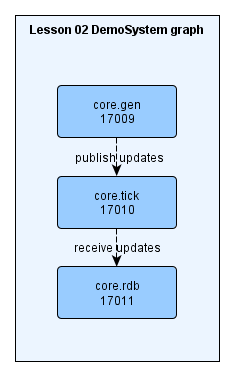
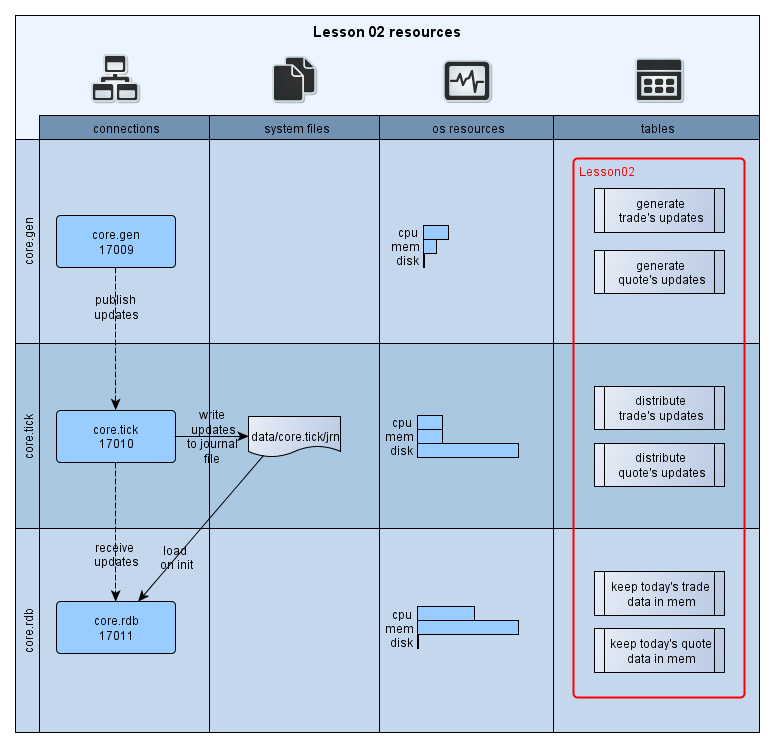
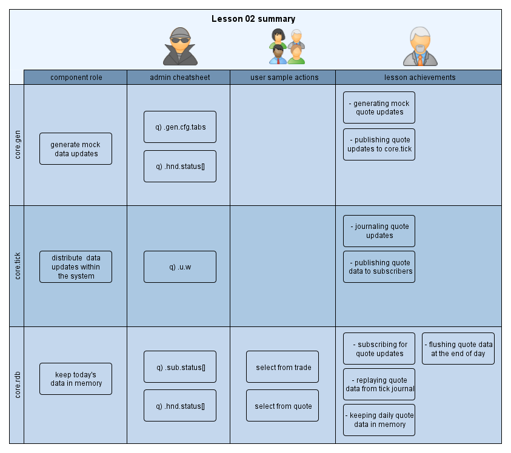

<!----------------- https://github.com/exxeleron/enterprise-components/tree/master/tutorial/Lesson02 ------------------>
[:arrow_backward:](../Lesson01) | [:arrow_forward:](../Lesson03)

#                                      **Lesson 2 - Adding `quote` table**

<!--------------------------------------------------------------------------------------------------------------------->
## Goal of the lesson

In this lesson we would like to extend the system from [Lesson 1](../Lesson01) and add one more table for storing quotes 
(table `quote`). Additionally, we will learn how to use templates to simplify management of data flow within the system.

<!--------------------------------------------------------------------------------------------------------------------->
## Prerequisites

It is assumed that [Installation](../Installation.md) page is read, system is deployed and working. 
Specifically these sections should be looked at in more detail:
- [System installation](../Installation.md#demosystem-installation)
- [System startup](../Installation.md#demosystem-startup)
- [Switching Lessons](../Installation.md#changing-demosystem-lesson)

<!--------------------------------------------------------------------------------------------------------------------->
## Components used

There are no changes here, we still use three components just as in [Lesson 1](../Lesson01):



<!--------------------------------------------------------------------------------------------------------------------->
## Resources in the system



<!--------------------------------------------------------------------------------------------------------------------->
## Configuration files

Our configuration files can be found in `ec/tutorial/Lesson02/etc`. Since there are no changes in components, 
this time we will only concentrate on `dataflow.cfg` file.

> Hint:

> It helps to diff `*.cfg` files from this lesson with files from previous lesson - that way any changes / extensions 
will be clearly visible. In following sections we have also used this approach when showing differences between two files:
> - `+` and `green` line indicates added line
> - `-` and `red` line indicates removed line
> - `@` is only used to highlight important sections in the code

### `dataflow.cfg`

Recall that in Lesson 1 definition of table `trade` was done in the following way:

```diff
 1. [table:trade]
 2. 
 3.   # Data model definition - list of colName(colType) pairs 
 4.   model = time(TIME), sym(SYMBOL), price(FLOAT), size(LONG)
 5.   
 6.   [[core.gen]]                # Data generation component for dummy trade updates
 7.     period = 5000             # frequency of data updates
 8.     pkgSize = 10              # size of each update package
 9.     
10.   [[core.tick]]               # Data distribution component
11.                               #       distribute trade table updates within the system
12.     
13.   [[core.rdb]]                # Collect intraday updates for trade table
14.     subSrc = core.tick        #  source server for the data - pointing to core.tick
15.     hdbConn = NULL            #  no hdb in current system setup
16.     eodClear = TRUE           #  clear trade table at the end of the day
17.     eodPerform = FALSE        #  don't store trade table at the end of the day
```

If we would like to add new table `quote` to our system, we could simply copy above snippet which differs in three 
aspects only. Please see lines:

- `1` - we are defining `qoute` table (vs. `trade`)
- `4` - data model for `qoute` table is different
- `7` - value for `period` is set to 1000 milliseconds (vs. 5000 for `trade` table)


```diff
--- dataflow.cfg     (trade table)
+++ dataflow.cfg     (quote table)
- 1. [table:trade]

+ 1. [table:quote]
  2. 
  3.   # Data model definition - list of colName(colType) pairs 
- 4.   model = time(TIME), sym(SYMBOL), price(FLOAT), size(LONG)
+ 4.   model = time(TIME), sym(SYMBOL), bid(FLOAT), bidSize(LONG), ask(FLOAT), askSize(LONG)

  5.   
  6.   [[core.gen]]                # Data generation component for dummy trade updates
- 7.     period = 5000             # frequency of data updates
+ 7.     period = 1000             # frequency of data updates
  8.     pkgSize = 10              # size of each update package

  9.     
 10.   [[core.tick]]               # Data distribution component
 11.                               #       distribute trade table updates within the system
 12.     
 13.   [[core.rdb]]                # Collect intraday updates for trade table
 14.     subSrc = core.tick        #  source server for the data - pointing to core.tick
 15.     hdbConn = NULL            #  no hdb in current system setup
 16.     eodClear = TRUE           #  clear trade table at the end of the day
 17.     eodPerform = FALSE        #  don't store trade table at the end of the day
```

As you can see there's a lot of repetition - except for table name (`[table:quote]`), `model` and `period` 
everything else is the same.

This is where templates can be used. Templates are exactly what they mean, for different tables they:
- provide means of declaring common parts 
- allow to define additional parameters
- support 'inheritance' for tables within the system

Revised definition for `trade` and `quote` tables using `marketData` template is shown below:


```diff
--- dataflow.cfg     (Lesson 1)
+++ dataflow.cfg     (Lesson 2)
+  1. [template:marketData]         # marketData template contains configuration 
+  2.                               # basis for all market data tables
+  3. 
+  4.   [[core.gen]]                # Random data generator  
+  5.     period = 5000             # default frequency of data updates for all tables
+  6.     pkgSize = 10              # size of each update package
+  7. 
+  8.   [[core.tick]]               # Data distribution component
+
+  9. 	                            
+ 10.   [[core.rdb]]                # Data collecting component
+ 11.     subSrc = core.tick        # source server for the data - pointing to core.tick
+ 12.     hdbConn = NULL            # no hdb in current system setup
+ 13.     eodClear = TRUE           # clear tables at the end of the day
+ 14.     eodPerform = FALSE        # don't store tables at the end of the day
+ 15. 
  16. [table:trade]                 # trade table definition based on marketData template
+ 17.   template = marketData       # Table trade is 'inheriting' all subsections and fields
+ 18.                               # from the marketData templates, each subsection or 
+ 19.                               # field can be overwritten here.
+ 20. 
  21.   # Table trade definition - model is specific to the table, therefore it was 
  22.   # not defined in the marketData template
  23.   model = time(TIME), sym(SYMBOL), price(FLOAT), size(LONG)
  24. 
-       [[core.gen]]                # Data generation component for dummy trade updates
-         period = 5000             # frequency of data updates
-         pkgSize = 10              # size of each update package
-     
-       [[core.tick]]               # Data distribution component
-                                   # distribute trade table updates within the system
-     
-       [[core.rdb]]                # Collect intraday updates for trade table
-         subSrc = core.tick        #  source server for the data - pointing to core.tick
-         hdbConn = NULL            #  no hdb in current system setup
-         eodClear = TRUE           #  clear trade table at the end of the day
-         eodPerform = FALSE        #  don't store trade table at the end of the day
+ 25. [table:quote]                 # quote table definition based on marketData template
+ 26.   template = marketData       # Table quote is also based on marketData template
+ 27.   
+ 28.   # Data model definition - list of colName(colType) pairs
+ 29.   model = time(TIME), sym(SYMBOL), bid(FLOAT), bidSize(LONG), ask(FLOAT), askSize(LONG)
+ 30. 
+ 31.   [[core.gen]]                # Data generation component - subsection from template  
+ 32.                               # marketData repeated here as one of its fields is overwritten.
+ 33.     period = 1000             # frequency changed for quote table, it is overwriting 
+ 34.                               # frequency value from the template
```

There are few interesting aspects here, see lines:
- `1` to `14` - we define a template which can be used for any table definition later in the configuration file
- `5` - we've defined a variable `period` and assigned its value to 5000 which will be 'inherited' by any other 
- table unless its value needs to be overwritten. Please note that:
    - `16` to `23` - table `trade` is missing definition of `period` variable as it inherits this parameter 
       and its value (5000)
    - `25` to `33` - table `quote` overwrites default value of `period` in line `33` with 1000
- `17` and `26` keyword `template` for tables `trade` and `quote` points to 'parent' table definition
- `23` and `29` - template itself doesn't contain model definition for each table, these are defined 
  in lines `23` and `29` for `trade` and `quote` tables respectively


<!--------------------------------------------------------------------------------------------------------------------->
## Using the system

### Check `rdb` tables

```q
q)/ execute on process core.rdb, port 17011
q) tables[]
quote
trade
```

### Check subscription status

```q
q)/ execute on process core.rdb, port 17011
q).sub.status[]
tab   | name  | src       | subProtocol     | srcConn | rowsCnt
------+-------+-----------+-----------------+---------+-------- 
quote | quote | core.tick | PROTOCOL_TICKHF | open    | 960
trade | trade | core.tick | PROTOCOL_TICKHF | open    | 1470
```

> Hint:

> Execute several times to see if the values are changing


### Check content of `trade` and `quote` tables 

```q
q)/ execute on process core.rdb, port 17011
q)  -3#trade
time         | sym     | price             | size 
-------------+---------+-------------------+-----
09:06:38.114 | instr43 | 65.32275422941893 | 72
09:06:38.114 | instr61 | 79.05246829614043 | 10
09:06:38.114 | instr18 | 80.97451596986502 | 32
q)  -3#quote
time         | sym     | bid               | bidSize | ask                | askSize
-------------+---------+-------------------+---------+--------------------+--------
08:22:01.546 | instr37 | 28.54233463294804 | 81      | 59.31096689309925  | 30
08:22:01.546 | instr8  | 60.82742747385055 | 15      | 12.640044651925564 | 81
08:22:01.546 | instr41 | 96.59238473977894 | 42      | 79.28916201926768  | 76
```

> Note:

> Data will differ as it's randomly generated

<!--------------------------------------------------------------------------------------------------------------------->
## Summary



<!--------------------------------------------------------------------------------------------------------------------->
[:arrow_backward:](../Lesson01) | [:arrow_forward:](../Lesson03)

<sub>[Super Mono Icons](http://files.softicons.com/download/toolbar-icons/super-mono-sticker-icons-by-double-j-design/readme.txt) 
by [Double-J Design](http://www.doublejdesign.co.uk/) / [CC BY 3.0](http://creativecommons.org/licenses/by/3.0/)</sub>
