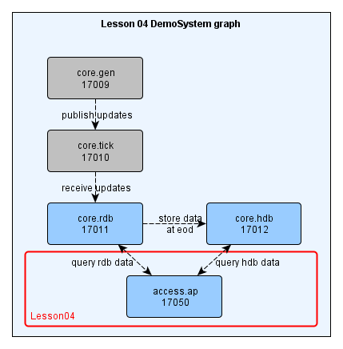
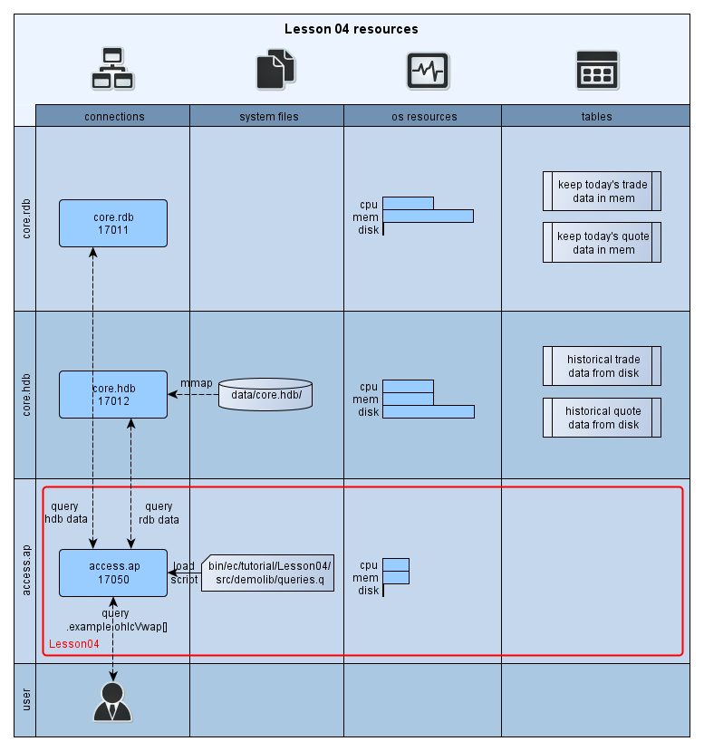
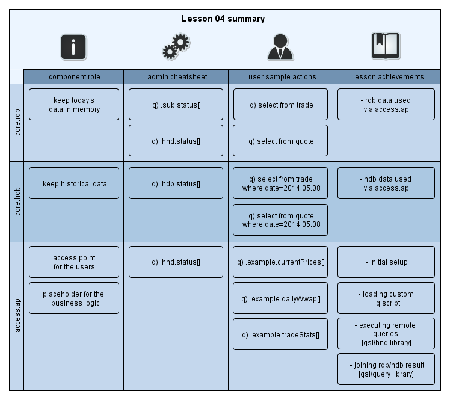

[:arrow_backward:](../Lesson03) | [:arrow_forward:](../Lesson05)
<!----------------- https://github.com/exxeleron/enterprise-components/tree/master/tutorial/Lesson04 ------------------>

#                                         **Lesson 4 - User queries**

<!--------------------------------------------------------------------------------------------------------------------->
## Goal of the lesson

In [Lesson 3](../Lesson03) we've added historical database and triggered end of day processing which wrote content of 
in-memory database (`rdb` - tables `trade` and `quote`) to `hdb`. In this lesson we will add a new component - `accessPoint`. 
This new component will load q file with custom queries enabling us to retrieve and process data from `rdb` and `hdb`.

<!--------------------------------------------------------------------------------------------------------------------->
## Prerequisites

It is assumed that [Installation](../Installation.md) page is read, system is deployed and working. 
Specifically these sections should be looked at in more detail:
- [System installation](../Installation.md#demosystem-installation)
- [System startup](../Installation.md#demosystem-startup)
- [Switching Lessons](../Installation.md#changing-demosystem-lesson)

<!--------------------------------------------------------------------------------------------------------------------->
## Components used

In this lesson we will expand system from [Lesson 3](../Lesson03) with `accessPoint`:

- `access.ap` - `accessPoint` is basically a container for business logic, it will:
  - load custom library with predefined queries
  - establish connections to `core.hdb` and `core.rdb` components
    
    


<!--------------------------------------------------------------------------------------------------------------------->
## Resources in the system




<!--------------------------------------------------------------------------------------------------------------------->
## Configuration files

### `system.cfg`

In [Lesson 3](../Lesson03) it was already shown how components are created: by adding relevant sub-section 
in the `system.cfg`. It's no different in this case - including `access.ap` is simply done by adding few lines
(`129` - `136`). 

`access.ap` component is located in new section `[group:access]` (line `127`) which highlights that this component belongs to different functional part of the created system.

> Note: 

> It is up to the system designer to decide on the grouping and names of components used within the system.

```diff
--- system.cfg     (Lesson 3)
+++ system.cfg     (Lesson 4)

   47. # List of directories with libraries. 
-  48. libPath = ${EC_SYS_PATH}/bin/ec/components/${EC_COMPONENT_PKG}, ${EC_SYS_PATH}/bin/ec/libraries/
+  48. libPath = ${EC_SYS_PATH}/bin/ec/components/${EC_COMPONENT_PKG}, ${EC_SYS_PATH}/bin/ec/libraries/, ${EC_SYS_PATH}/bin/ec/tutorial/Lesson04/src

...

+ 127. [group:access]
+ 128.
+ 129.   [[access.ap]]                        # Component named 'access.ap' (EC_COMPONENT_ID) - access point for the users, contains business logic
+ 130.    command = "q accessPoint.q"         # - command line string
+ 131.    libs = demolib/queries              # - loading custom library "demolib/queries.q" with custom queries.
+ 132.    type = q:accessPoint/accessPoint    # - q component of type 'accessPoint' (EC_COMPONENT_TYPE) 
+ 133.                                        #   from package 'accessPoint' (EC_COMPONENT_PKG)      
+ 134.    port = ${basePort} + 50             # - port 
+ 135.    memCap = 5000                       # - q process memory cap in MB (-w q option)
+ 136.    cfg.serverAux = core.rdb, core.hdb  # - list of servers that will be used by the accessPoint queries
```

#### Loading libraries using `libs` field

All custom queries used in this lesson are defined in `demolib/queries.q` file under `tutorial/Lesson04/src/` directory.

Custom libraries are loaded by setting `libs` field in the component's subsection (line `131`). 
In our case `libs` field contains one library `demolib/queries`.
System searches for `demolib/queries` library in all paths defined in `libPath` (line `48`).
First file matching following pattern will be loaded:
 
```
[ libPath ] + [ libs ] + [ .q ]
```

In our case, it will search for the following files and load the first one which is available:

```
 ${EC_SYS_PATH}/bin/ec/components/${EC_COMPONENT_PKG}/demolib/queries.q
 ${EC_SYS_PATH}/bin/ec/libraries/demolib/queries.q    
 ${EC_SYS_PATH}/bin/ec/tutorial/Lesson04/src/demolib/queries.q    <<<< load first existing "demolib/queries" lib 
```

File `${EC_SYS_PATH}/bin/ec/tutorial/Lesson04/src/demolib/queries.q` will be loaded to the process.

> Note: 

> Loading custom libraries with `libs` field can be used in all components.  

<!--------------------------------------------------------------------------------------------------------------------->
## Using the system

### Check system state

```bash
DemoSystem> yak info \*
  uid                pid   port  status      started             stopped            
  ----------------------------------------------------------------------------------
  access.ap          11280 17050 RUNNING     2014.05.08 07:40:03
  core.gen           11281 17009 RUNNING     2014.05.08 07:40:03                    
  core.hdb           11290 17012 RUNNING     2014.05.08 07:40:04
  core.rdb           11293 17011 RUNNING     2014.05.08 07:40:04                    
  core.tick          11287 17010 RUNNING     2014.05.08 07:40:03
  
```

### Check connections

We use `accessPoint` component for querying both `rdb` and `hdb`. 
Therefore, it is vital that both connections are configured and the data is available. 

```q
q)/execute on process access.ap, port 17050
q).hnd.status[]
server  | timeout | state      | connstr            | handle | ashandle | topen              
--------+ --------+------------+--------------------+--------+----------+-------------------------------
core.hdb| 100     | registered |  ::17012:tu:0x5... |  10i   | -10i     | 2014.06.02D09:24:29.134865000   
core.rdb| 100     | registered |  ::17011:tu:0x5f...|  11i   | -11i     | 2014.06.02D09:24:33.832915000       
```

Please note `state` `registered` which indicates that no connection attempts have been made so far. Other possible states are:

- `open` - connection to client is open and ready to use   
- `close` - connection to client was closed by server (e.g. server disconnected)  
- `lost` - connection to client was lost (e.g. client was terminated)  
- `failed` - attempt to connect to client failed (e.g. client is not running)  

### Check if `DemoSystem/data/core.hdb` contains `hdb` data

```q
q)/ execute on process core.hdb, port 17012
q) .hdb.status[] 
tab   | format     | rowsCnt | err |  columns    
------+------------+---------+-----+---------------------------------------------
quote | PARITIONED | 3570    |     | `date `sym `time `bid `bidSize `ask `askSize
trade | PARITIONED | 720     |     | `date `sym `time `price `size
```

### Check if library is properly loaded in `access.ap`

All custom queries are defined in the `ec/tutorial/Lesson04/src/demolib/queries.q` file (please compare to the line `48` of `system.cfg` presented above). Code is written according to Exxeleron q [coding conventions](../../../../wiki/Exxeleron-q-coding-conventions).  All queries are written in the `.example` namespace. 

To see the full list of queries from q:

```q
q)/ execute on process access.ap, port 17050
q) \f .example
bigBuyOrders
currentPrices
dailyVwap
```

### Check queries available in `access.ap`

> Note:

> The following section presents some basic q queries and it is dedicated to fresh q users. If you already
have experience with q, you can omit it.

In order to execute one of the custom queries, type its name and provide all parameters in square brackets separated by semicolons. More about q functions can be found in [Q for Mortals](http://code.kx.com/wiki/JB:QforMortals2/functions#Overview) from Jeffry A. Borror.


```q
q)/ execute on process access.ap, port 17050
q) .example.functionalLastPriceNMinutesBar[30i; `instr0]
sym    | minute | price
-------+--------+--------
instr0 | 06:00  |	29.67
instr0 | 06:30  |	12.49
instr0 | 07:00  |	0.28

q) .example.vwap[]
sym     | vwap  
--------+------
instr0	| 50.04
instr1	| 54.12
instr10	| 47.73
```

> Note:

> For simplicity `quote` and `trade` tables are generated automatically and independently using `core.gen` component. Therefore, inconsistencies such as `price` higher/lower than `bid`/`ask` may occur. 

To see the body of the query, type its name: 

```q
q)/ execute on process access.ap, port 17050
q) .example.vwap
"{[] .hnd.h[`core.rdb] "select vwap: size wavg price by sym from trade"}"
```

> Note:
> For interprocess communication the `qsl/handle.q` library is used. 

### Examples of different custom queries. 

#### `rdb` queries
The number of records in `quote` table by hour:

```q
q)/ execute on process access.ap, port 17050
q).example.tradeStats[]
hh   | cnt
-----+------
5    | 120
6    | 3001
```

Records from `quote` and `trade` tables are joined based on the `time` and `sym` columns using `aj` function.

> Hint:

> For more details about joints available in q, please visit official Kx [reference](http://code.kx.com/wiki/Reference/joins) page.


```q
q).example.tradeAndQuote[]
time         | sym     | price | size | bid   | bidSize | ask   | askSize
-------------+---------+-------+------+-------+---------+-------+---------
05:59:53.937 | instr98 | 78.94 | 25	  | 95.92 | 91	    | 72.69 | 99
05:59:53.937 | instr17 | 42.44 | 18	  | 53.00 | 56	    | 48.86 | 33
```

Last `price` by symbol from `trade` table:

```q
q).example.currentPrices[]
sym   | price   
------+ --------
instr0| 65.24
instr1| 72.48
```

Last `price` in 10 minutes bars for first symbol from `trade` table:


```q
q).example.lastPrice10MinutesBar[]
minute| price   
------+ ------
05:45 | 72.67 
06:00 | 80.53
```

> Hint:

> More about grouping using `xbar` can be found [here](http://code.kx.com/wiki/Reference/xbar).

Last `price` in 30 minutes bars for symbol `instr0` from `trade` table:

```q
q) .example.functionalLastPriceNMinutesBar[30i; `instr0]
sym    | minute | price
-------+--------+--------
instr0 | 06:00  |	29.67
instr0 | 06:30  |	12.49
instr0 | 07:00  |	0.28
```

Orders for which `bid` size was greater than average by symbol from `quote` table:

```q
q).example.bigBuyOrders[]
time         | sym    | bid   | bidSize | ask     | askSize
-------------+--------+-------+---------+---------+----------
05:59:48.935 | instr1 | 37.56 | 64      | 97.85   | 34     
05:59:48.935 | instr73| 52.94 | 82      | 94.416  | 61  
```

Volume-weighted average `price` by symbol:

```q
q) .example.vwap[]
sym     | vwap  
--------+------
instr0	| 50.04
instr1	| 54.12
instr10	| 47.73
```

#### `hdb` queries

Volume-weighted average `price` by symbol and date:

```q
q)/ execute on process access.ap, port 17050
q).example.dailyWwap[]
sym    |  date      | vwap    
-------+------------+-----
instr0 | 2014.05.28 | 51.99
instr1 | 2014.05.28 | 51.49
```

`open`, `high`, `low`, `close`, volume-weighted average `price` from `hdb` `trade` table aggregated by `date`, `symbol` and `time` bars:

```q
q).example.ohlcVwap[`instr0`instr1;.z.d-2; 08:00:00; 20:00:00; 600]
date       |sym     | time     | open  | high  | low   | close | size | vwap    
-----------+--------+----------|------ +-------+-------+-------+------+------
2014.05.28 | instr0 | 09:00:00 | 70.80 | 70.80 | 70.80 | 70.80 | 83   | 70.80
2014.05.28 | instr0 | 09:10:00 | 15.95 | 86.75 | 11.53 | 11.53 | 420  | 49.15

```

#### `hdb` and `rdb` queries - `qsl/query` lib


Until now, we queried `rdb` and `hdb` separately. In case of queries which retrieve data from both components there is a possibility to use dedicated library `libraries/qsl/query.q`. A function `.query.data` is defined there and detailed documentation with examples of use is provided. Below only one example is shown, the same function as above, but with data from both components.

> :exclamation: Note:

> Explaining the q syntax for queries is outside of the scope of this document. In particular, there's significant difference between using q-sql for in-memory (`rdb`) and persistent databases (`hdb`). More details can be obtained from thorough "Q for Mortals" from 
Jeffry A. Borror ([rdb queries](http://code.kx.com/wiki/JB:QforMortals2/queries_q_sql) and [hdb queries ](http://code.kx.com/wiki/JB:KdbplusForMortals/contents)).
  
`open`, `high`, `low`, `close`, volume-weighted average `price` from `hdb` and `rdb` `trade` table aggregated by `date`, `symbol` and `time` bars:

```q
q)/ execute on process access.ap, port 17050
q).example.ohlcVwap2[syms;(.z.d-2;.z.d); 06:00:00; 20:00:00; 600]   
date       |sym     | time     | open  | high  | low   | close | size | vwap    
-----------+--------+----------|------ +-------+-------+-------+------+-------
2014.05.28 | instr0 | 09:00:00 | 70.80 | 70.80 | 70.80 | 70.80 | 83   | 70.80
2014.05.28 | instr0 | 09:10:00 | 15.95 | 86.75 | 11.53 | 11.53 | 420  | 49.15
```

> Note:

> If you would like to add more custom queries, modify one of the libraries specified in the `system.cfg` file and restart `access.ap` process. 

<!--------------------------------------------------------------------------------------------------------------------->
## Summary



<!--------------------------------------------------------------------------------------------------------------------->
[:arrow_backward:](../Lesson03) | [:arrow_forward:](../Lesson05)

<sub>[Super Mono Icons](http://files.softicons.com/download/toolbar-icons/super-mono-sticker-icons-by-double-j-design/readme.txt) 
by [Double-J Design](http://www.doublejdesign.co.uk/) / [CC BY 3.0](http://creativecommons.org/licenses/by/3.0/)</sub>
