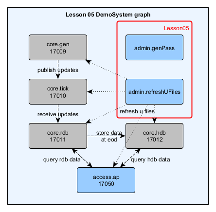
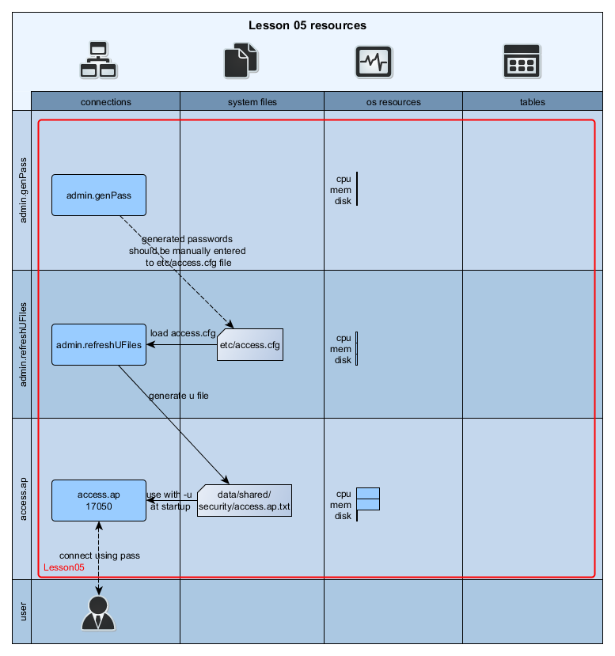
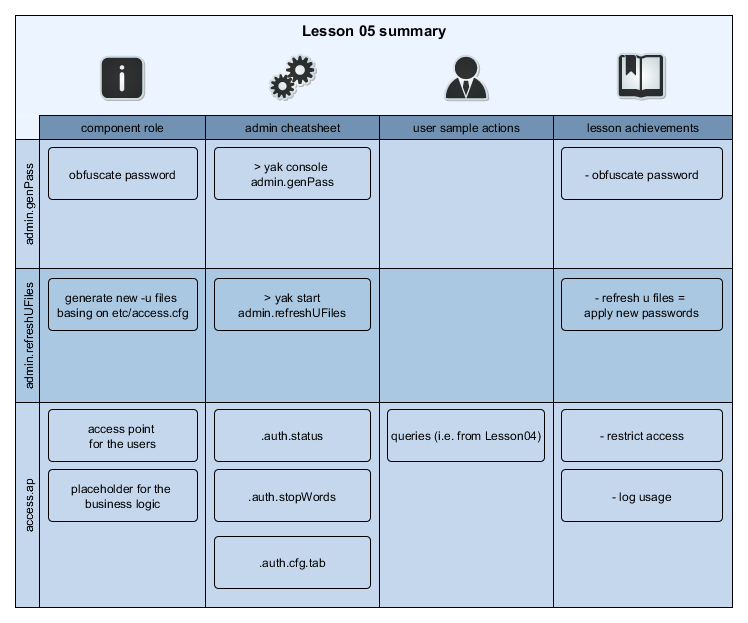

[:arrow_backward:](../Lesson04)
<!------------------------------------------------------------------------------------------------->

<!------- https://github.com/exxeleron/enterprise-components/tree/master/tutorial/Lesson05 -------->

#                     **Lesson 5 - Authentication and authorization**

<!------------------------------------------------------------------------------------------------->
## Goal of the lesson

In [Lesson 4](../Lesson04) we added new component - `accessPoint`. This component exposes query
interfaces for users to run. In this lesson we will learn how to extend this component with security
settings.

<!------------------------------------------------------------------------------------------------->
## Prerequisites

It is assumed that [Installation](../Installation.md) page is read, system is deployed and
working. Specifically these sections should be looked at in more detail:
- [System installation](../Installation.md#demosystem-installation)
- [System startup](../Installation.md#demosystem-startup)
- [Switching Lessons](../Installation.md#changing-demosystem-lesson)

> Note:
> 
> In this lesson additional command must be run before system is started:
> ```bash
> DemoSystem> yak console admin.refreshUFiles
> ```

<!------------------------------------------------------------------------------------------------->
## Components used

This lesson expands the system from [Lesson 4](../Lesson04) with two administrative components: 
`authentication/genPass` and `authentication/refreshUFiles`. Additionally, `accessPoint`
configuration will be extended with:

- new users and groups
- user access restrictions
    


<!------------------------------------------------------------------------------------------------->
## Resources in the system




<!------------------------------------------------------------------------------------------------->
## Enterprise Components security model

Enterprise Components can be setup to allow only specific users in the system
(_authentication_). Those users can be granted access only to specific resources
(_authorization_). 

### Authentication

Authentication specifies which users can log to the system. It is possible to differentiate
component instances with different user sets.

Authentication in Enterprise Components utilizes raw `-u`/`-U` command line parameters passed to
`q`.
 
> Note:
>
> You can read more about `-u`/`-U` `q` command line parameters
> [here](https://code.kx.com/wiki/Reference/Cmdline).


### Authorization

Authorization specifies access to resources available to users. It also specifies how detailed
should be the checks of queries issued by users.

It is possible to block query execution based on forbidden words (`stopWords`) or allowed `q`
 namespaces.

Authorization checks can be set on different levels:
- `NONE` - do not perform any query checks; allow user to freely run code. Recommended for technical
  users.
- `STRICT` - allow only functional-form queries; do not check `stopWords`; check function name against
  allowed namespaces. Recommended for interface functions' calls (e.g. from [`qJava`](https://github.com/exxeleron/qJava))
- `FLEX` - perform detailed check on a query (functional or passed as string); check against
  `stopWords` and allowed namespaces but allow nested function calls

<!------------------------------------------------------------------------------------------------->
## Configuration files

### `system.cfg`

Authentication flags (`uOpt`/`uFile`) are set in `system.cfg` file. 

You can enable or disable authentication in `system.cfg` configuration file. Component instances
which have `uOpt` (line `93`) and `uFile` (line `96`) flags set will allow only users defined in
`access.cfg` file.


```diff
--- system.cfg     (Lesson 4)
+++ system.cfg     (Lesson 5)

+ 91. #------------------------------------ security -------------------------------#
+ 92.   # use specified user flag on all processes (unless redefined somewhere)
+ 93. uOpt = U
+ 94.   # use specified user file on all processes (unless redefined somewhere)
+ 95.   # Each component instance gets it's own user file.
+ 96. uFile = ${EC_SYS_PATH}/data/shared/security/${EC_COMPONENT_ID}.txt

...

+ 144. [group:admin]
+ 145.   [[admin.genPass]]         # component 'admin.genPass' (EC_COMPONENT_ID) used for
+ 146.                             # interactive password generation
+ 147.     uOpt = NULL             # uOpt and uFile cannot be set on this component. Redefining
+ 148.     uFile = NULL            # those values here.
+ 149.     port = 0                # port field has no default value. In order to run process
+ 150.                             # without port, set it to zero
+ 151.     type = b:authentication/authentication
+ 152.     command = "q genPass.q"
+ 153.
+ 154.   [[admin.refreshUFiles]]   # component 'admin.refreshUFiles' (EC_COMPONENT_ID) refreshing
+ 155.                             # user files
+ 156.     uOpt = NULL
+ 157.     uFile = NULL
+ 158.     port = 0
+ 159.     type = b:authentication/authentication
+ 160.     command = "q refreshUFiles.q"
```

### `access.cfg`

Users, groups and authorization are defined in `access.cfg` file.

```diff
--- access.cfg     (Lesson 4)
+++ access.cfg     (Lesson 5)

+ 20. #---------------------------- ordinary users ---------------------------------#
+ 21.   # ordinary users are used by end-users of the system. 
+ 22.   # users are defined each in its own section, with pass and usergroups fields
+ 23.   # set (similar to technicalUser above).
+ 24. [user:demo]
+ 25.   pass = 0xaaaba3a1bbbdabbc # Password as generated by admin.genPass script.
+ 26.   usergroups = demoquery    # Groups users is assigned to. (Groups defined below.)

...

+ 37. [userGroup:demoquery]
+ 38.   # List of forbidden words. Including any of these words in a query will cause query
+ 39.   # to be blocked.
+ 40.   stopWords = delete,exit,access,value,save,read0,read1,insert,update,system,upsert,set,.z.pw,.z.pg,.z.ps,.z.pi,.z.ph,.z.pp,.z,parse,eval,.q.parse,.q.eval,.q.system,.z.exit,.z.po,.z.pc,.ap.cfg.serverAux,.ap.cfg.timeout,.auth.stopWords,.auth.status,.auth.user2nm,\\,\)
+ 41.   [[ALL]]
+ 42.     checkLevel = STRICT # By default allow only parse-tree queries and only to .hnd
+ 43.                         # namespace
+ 44.     namespaces = .hnd
+ 45.   [[access.ap]]
+ 46.     checkLevel = FLEX   # Allow executing `freestyle` queries but check them against
+ 47.                         # stopWords and available namespaces
+ 48.     namespaces = .demo

```

## Using the system

### Generating user passwords

Passwords stored in Enterprise Components configuration files are obfuscated by using `XOR` against
built-in mask. (`.sl.p.m` variable in `qsl/sl.q` file)

> Note:
>
> Passwords are protected (obfuscated) only to avoid from accidential reading.

In order to generate a new password for a user (`XOR` password), please run `admin.genPass` in
interactive mode (we used `demouser` as a password for a user we added in this lesson):

```bash
DemoSystem> yak console admin.genPass
Starting interactive console...
[ --- output truncated --- ]
Please enter new password: demouser
Please re-enter new password: demouser
New password is: 0xaaaba3a1bbbdabbc
```

New password value is given in hexadecimal representation. It should be placed in `access.cfg`
exactly as returned by `admin.genPass`.

### Applying password to the system (`refreshUFiles`)

In order to apply new password to configured components, _u files_ need to be refreshed. Run:

```bash
DemoSystem> yak console admin.refreshUFiles
Starting interactive console...
[ --- output truncated --- ]
INFO  2014.06.01 03:05:11.775 ru    - Refreshing user access files...
INFO  2014.06.01 03:05:11.786 ru    - Create security file in :/DemoSystem/data/shared/security/access.ap.txt with #users:2
INFO  2014.06.01 03:05:11.786 ru    - Create security file in :/DemoSystem/data/shared/security/core.gen.txt with #users:2
INFO  2014.06.01 03:05:11.787 ru    - Create security file in :/DemoSystem/data/shared/security/core.hdb.txt with #users:2
INFO  2014.06.01 03:05:11.787 ru    - Create security file in :/DemoSystem/data/shared/security/core.rdb.txt with #users:2
INFO  2014.06.01 03:05:11.787 ru    - Create security file in :/DemoSystem/data/shared/security/core.tick.txt with #users:2
INFO  2014.06.01 03:05:11.787 ru    - Refresh completed
```

> Note:
>
> In this lesson the above command should be run at least once on a newly installed system before any component is started. 

### Verifying access settings

#### FLEX check level - sample queries

As mentioned before, `FLEX` allows to execute queries that conform to allowed namespaces and do not
contain any words specified in `stopWords`:

```
/ execute on access.ap (port 17050) as 'demo' user
q).example.tradeStats[]
hh| cnt  
--| -----
19| 10500
```

It is also possible to pass nested function calls as parameters to predefined queries:

```
/ query with function call as a parameter
q).example.tradeStats[1+1]
hh| cnt  
--| -----
19| 10550
```
Anonymous functions are also allowed in queries, unless they contain any `stopWords`:

```
/ query with anonymous function as parameter (might cause side-effects and be potentially dangerous)
q).example.tradeStats[{sum x}[1 1]]
hh| cnt  
--| -----
19| 10590
// stop word included in query body
q).example.tradeStats[{delete from .hnd.status}`]
'access denied

```

#### STRICT check level - sample queries

Default connections visible in `.hnd.status` use technical user (which has all the access rights to
all namespaces). We need to add a new connection to `core.rdb` process but with a different user
(demo/demouser):

```
/ execute on access.ap (port 17050) as technical user (tu/tuuser).
q).hnd.hopen[enlist[`strict.demo]!enlist[`$"::17011:demo:0xaaaba3a1bbbdabbc"];100i;`eager]

/ check new connection in .hnd.status table
q).hnd.status
server
---------

core.hdb
core.rdb
strict.demo

/ execute queries in a parse-tree form
q)key .hnd.h[`strict.demo] (`.hnd.status;::)
server
---------
         
core.hdb 
core.tick

q).hnd.h[`strict.demo] (`.hnd.hopen;`access.ap;100i;`eager)
q)key .hnd.h[`strict.demo] (`.hnd.status;::)
server
---------
         
core.hdb 
core.tick
access.ap
```

We are not allowed to pass functions not from `.hnd` namespace as parameters (function `key`).

```
q).hnd.h[`strict.demo] (key;`.hnd.status)
'unsupported query type for check level: STRICT, query: (!:;`.hnd.status)
/ Which is allowed for technical user
q).hnd.h[`core.rdb] (key;`.hnd.status)
server
---------
         
core.hdb 
core.tick
access.ap
```

String queries are also not allowed on STRICT level. Such queries are usually send from kdbStudio or
other IDEs.

```
q).hnd.h[`strict.demo] "1+1"
'unsupported query type for check level: STRICT, query: "1+1"
/ Queries from other namespaces are blocked
q).hnd.h[`core.rdb.demo] (`.cb.status;::)
'access denied

```
> Note:

> For more details on `.hnd.status` table or `.hnd` interface functions please refer to the source
> code documentation in [`libraries/qsl/handle.q`](../../libraries/qsl/handle.q).

#### NONE check level - sample queries

As we already have seen, technical user can execute queries without any restrictions. It is possible
to assign such check level also to ordinary users (non-technical). Such configuration should be
assigned only for __trusted__ users. Please follow to next section, where such example user will be
added.

#### Additional user and group

As mentioned before, users, passwords and usergroups are stored in `access.cfg` configuration
file. Let's add a new user (`usernone`) with password `nonepassword`. Our new user will be assigned
to `trusted` group of users. `trusted` group will have full access to `access.ap` process and will
be restricted only on `core.rdb` (where all queries containing words "quote" or "trade" will be
blocked).

```
DemoSystem> yak console admin.genPass
Starting interactive console...
[ --- output truncated --- ]
INFO  2014.06.16 22:13:29.424 gp    - | status=`EVENT_STARTED| descr="initializing gp component"| funcName=`.gp.genpass| arg=`| defVal=`| tsId=2014.06.16D22:13:29.423947000

Please enter new password: nonepassword
Please re-enter new password: nonepassword
New password is: 0xa0a1a0abbeafbdbdb9a1bcaa
```

User and group definition can now be put into `etc/access.cfg` file:

```
[user:usernone]
  pass = 0xa0a1a0abbeafbdbdb9a1bcaa
  usergroups = trusted

[userGroup:trusted]
  [[access.ap]]
    namespaces = ALL
    checkLevel = NONE
  [[core.rdb]]
    stopWords = trade, quote
    namespacess = ALL
    checkLevel = FLEX

```

After running `admin.refreshUFiles` we can see that we have access to every namespace on `access.ap`
proces. It is left as an excercise for the reader to compare possible queries as `usernone` and
`demo` user.

In contrast, queries on `core.rdb` containing words listed in `stopWords`
configuration field will not be allowed:


```
/executed on core.rdb as usernone
q)select from trade
'access denied
```

## Summary



<!--------------------------------------------------------------------------------------------------------------------->
[:arrow_backward:](../Lesson04)

<sub>[Super Mono Icons](http://files.softicons.com/download/toolbar-icons/super-mono-sticker-icons-by-double-j-design/readme.txt) 
by [Double-J Design](http://www.doublejdesign.co.uk/) / [CC BY 3.0](http://creativecommons.org/licenses/by/3.0/)</sub>
